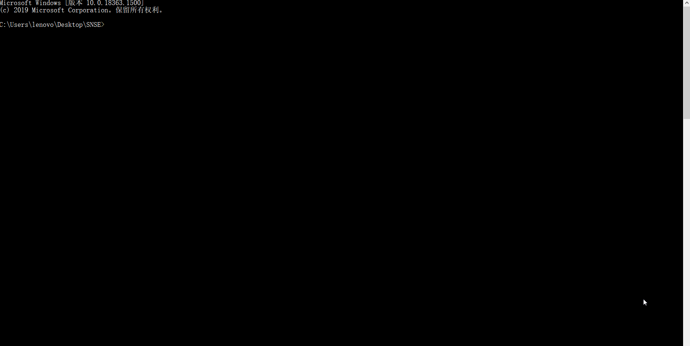

<center><h3>SNSE (Simple News Search Engine)</h3></center>
<br/>

本项目是一个简单的新闻搜索引擎，主要包括三个基础模块：

* 数据模块：爬取和保存数据，数据源为[中国社会科学网](http://his.cssn.cn/lsx/sjls/)
* 索引模块：构建和保存索引，这里的索引是指**倒排索引**
* 搜索模块：搜索主逻辑，采用 BM25 算法计算 query 与 document 之间的相似度

<br/>

项目的目录结构如下：

* `main.py`：入口文件
* `models.py`：各模块定义
* `config.ini`&nbsp;&nbsp;：配置文件

<br/>

你可以通过以下命令运行此项目：

```shell
python main.py
```

这将会依次执行数据模块爬取和保存数据、执行索引模块构建和保存索引、执行搜索模块进行查询

如果你已经运行过程序，将会在 `resource` 目录下保存有数据文件 `data.csv` 和索引文件 `iindex.json`

<br/>

程序的运行过程与结果如下：

